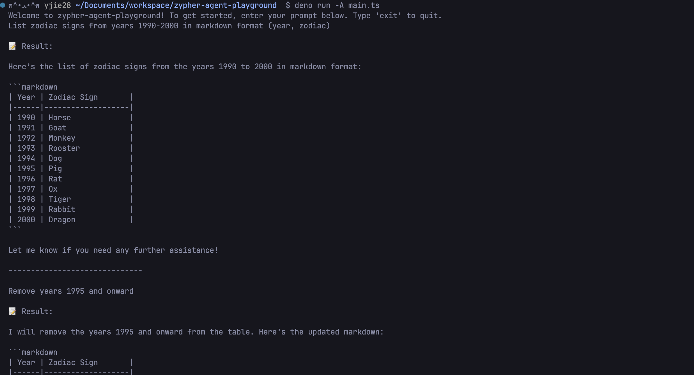

# 🌟 zypher-agent-playground

This CLI agent was built with [Zypher](https://zypher.corespeed.io) to demonstrate interactive natural language processing via terminal. Powered by GPT-4o-mini, it handles open-ended prompts with streaming output, and showcases lightweight multi-turn reasoning.

<p align="center"><i>A quick preview: </i></p>



---

## 🖥️ Demo

→ [Click here to watch the recorded demo](https://drive.google.com/file/d/1jPxvsptVLAEZ28zjyw_8751tg8Q0gK6K/view?usp=sharing)

This demo showcases the agent handling open-ended prompts (e.g., listing Chinese zodiac signs), as well as a follow-up command to revise the output ("remove years 1995 and onward" and "add brief personality trait").

## 🛠️ Tech Stack

- Zypher agent SDK
- Deno runtime + TypeScript
- GPT-4o-mini (via OpenAI API)
- Streaming output handling with `rxjs-for-await`

## 🚀 Getting Started

⚙️ **Prerequisites**

- [Deno 2.0+](https://docs.deno.com/runtime/getting_started/installation/)
- An OpenAI (or your preferred LLM) API key

🪛 **Setup**

```bash
# Clone this repo
$ git clone https://github.com/yjie10/zypher-agent-playground

# Install required dependencies (Zypher SDK & streaming helper)
$ deno add jsr:@zypher/agent
$ deno add npm:rxjs-for-await

# Set your Preferred LLM API key (I'm using OpenAI) in .env
export OPENAI_API_KEY=your_api_key

# Run the agent (requires deno)
$ deno run -A main.ts
```

Then enter your prompt right in the terminal!

## 📒 Reflections

This was my first time building an AI agent as well as working with Deno.
I learned a lot through the process, including streaming response handling, prompt engineering for multi-turn tasks, and working with Deno-based SDKs from scratch.

During development, I temporarily hard-coded the API key because `deno run` required interactive permission flags (e.g., `--allow-env`) and would prompt for approval each time.  
For final submission, I switched back to environment variable access using `.env` + `Deno.env.get(...)` as recommended in the official docs.

P.S. Originally, I had planned to use Zypher’s built-in interactive CLI mode, but due to missing modules (`runAgentInTerminal`) in the public SDK, I implemented a custom REPL-like loop that continuously accepts user prompts and displays markdown-formatted results.

## ✏️ Submission Notes

This project was created as part of the Zypher technical assessment.
Everything was built from scratch based on public documentation, with extra attention to user experience and clarity in CLI interaction.

I also explored the possibility of building a minimal web UI, which would require wrapping the agent inside a Deno HTTP server. Due to time constraints I focused on CLI interaction, but the architecture allows easy extension toward a browser-based UI.
